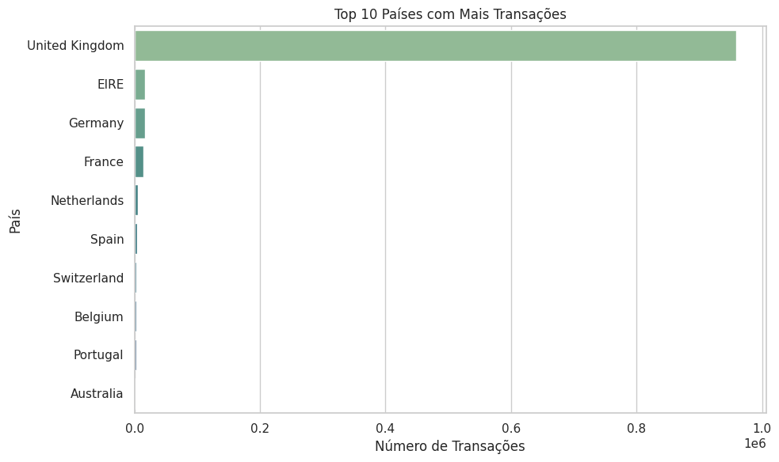
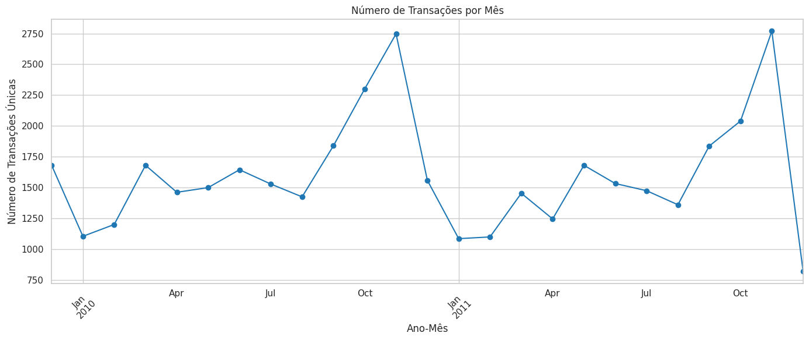
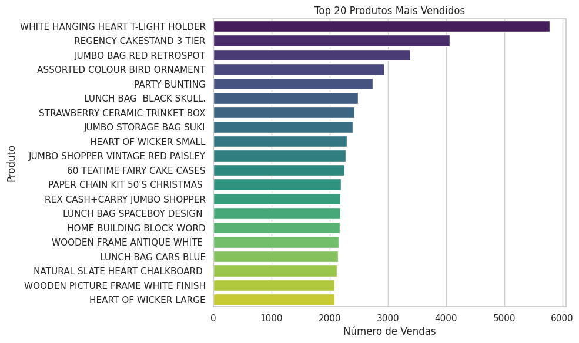
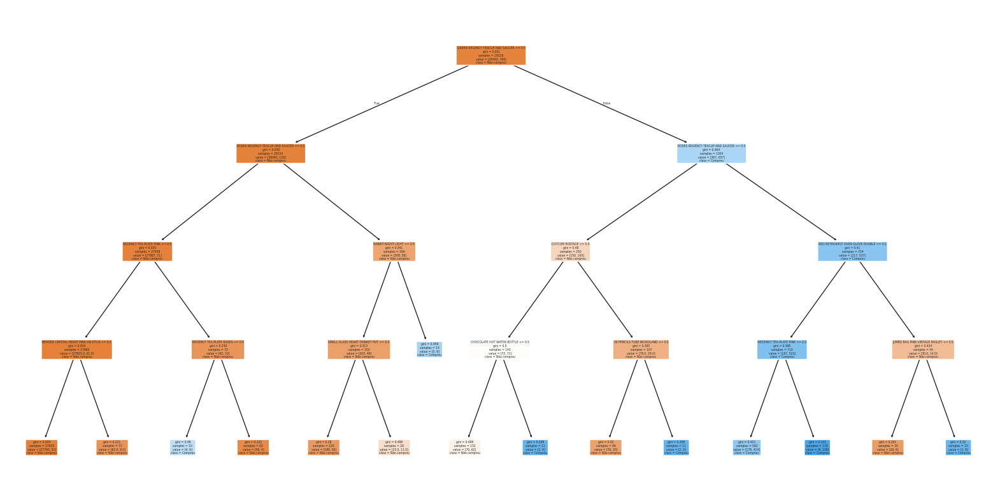
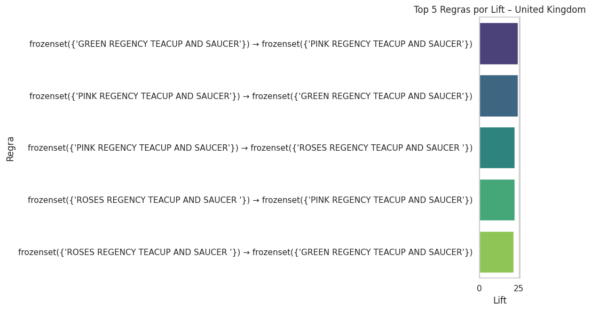
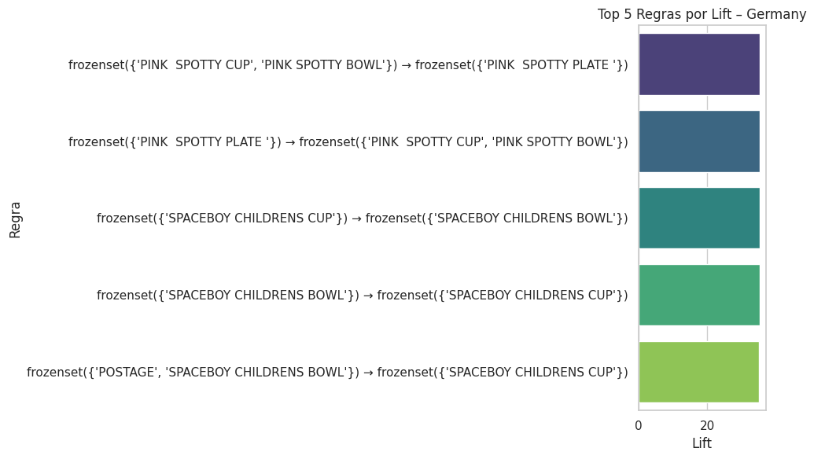
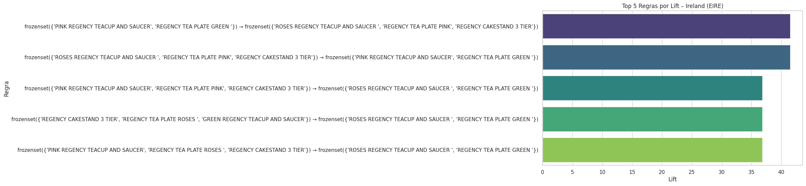

# 🛒 Frequent Itemset Mining & Decision Tree – Market Basket Analysis

This project explores consumer purchase behavior using the **Online Retail II** dataset from UCI/Kaggle. It applies **Frequent Itemset Mining** (Apriori algorithm) and **Decision Tree Classification** to uncover actionable insights in retail transactions.

---

## 💡 Objective

To extract frequent product combinations using association rules (Apriori) and compare them with rules derived from Decision Tree models trained to predict the purchase of a specific item. The goal is to support marketing strategies such as cross-selling, bundling, and personalized recommendations.

---

## 📁 Project Structure

- `trabalho2_am1.py`: Python script with all data processing and mining routines
- `Trabalho_2___AM1.pdf`: Final academic report with methodology, results, and discussion
- `README.md`: Project documentation
- `dataset_link.txt`: Contains the public link to the dataset used

---

## 🛠️ Methods Applied

- Data filtering and preprocessing (handling cancellations, missing data, and item quantities)
- Market Basket Analysis with **Apriori** from `mlxtend`
- Association rule generation using **support**, **confidence**, and **lift**
- Construction of **Decision Trees** to predict purchase of a target item
- Extraction of interpretable rules from tree leaves
- Comparative analysis between both techniques

---

## 🌍 Preliminary Insights

### 🗺️ Transactions by Country



> The vast majority of transactions come from the **United Kingdom**, followed by Germany and France.

### 📆 Seasonality



> Strong end-of-year purchasing trend, with December showing peak activity.

### 🛍️ Top-Selling Products



> Best-selling products are mostly decorative items and home accessories.

---

## 🔍 Case Study: PINK REGENCY TEACUP AND SAUCER

To ensure a fair comparison, both Apriori and Decision Tree were evaluated on a **restricted scenario**:  
Transactions from the **United Kingdom**, focused on the product:

> **PINK REGENCY TEACUP AND SAUCER**

---

## 📊 Example Rules Extracted

### 📌 Apriori Rule

- `REGENCY TEA PLATE ROSES` → `PINK REGENCY TEACUP AND SAUCER`  
  **Confidence:** 0.91 — **Support:** 2.8% — **Lift:** 31.7

### 🌳 Decision Tree Leaf Rule (Simplified)

- Items: `GREEN`, `ROSES`, `TEA PLATE PINK`, etc.  
  **Confidence:** 0.85 — **Support:** 0.27% — **Lift:** 35.9

### 🧠 Decision Tree Structure



---

## 📌 Lift by Country

### 🇬🇧 United Kingdom



### 🇩🇪 Germany



### 🇮🇪 Ireland



---

## 🔍 Item Target – Case Study

To ensure a fair comparison, both Apriori and Decision Tree were evaluated on a **restricted scenario**:  
Transactions from the **United Kingdom**, with focus on the product:

> **PINK REGENCY TEACUP AND SAUCER**

---

## 📊 Example Rules Extracted

### 📌 Apriori Rule

- `REGENCY TEA PLATE ROSES` → `PINK REGENCY TEACUP AND SAUCER`  
  **Confidence:** 0.91 — **Support:** 2.8% — **Lift:** 31.7

### 🌳 Decision Tree Leaf Rule (Simplified)

- Items: `GREEN`, `ROSES`, `TEA PLATE PINK`, etc.  
  **Confidence:** 0.85 — **Support:** 0.27% — **Lift:** 35.9

---

## 📈 Key Insights

- Both techniques identified similar associations around coordinated product lines (e.g., “Regency”).
- Apriori yielded more general and high-support rules across all data.
- Decision Trees focused on narrower, high-confidence subgroups and showed higher **lift** in certain leaves.
- The two approaches are complementary: Apriori excels in discovering broad frequent patterns, while Decision Trees isolate **local high-precision segments**.

---


## 🚀 How to Run

### 1. Clone the repository
```bash
git clone https://github.com/your-username/frequent-itemset-mining.git
cd frequent-itemset-mining
```

### 2. Install requirements
```bash
pip install pandas mlxtend scikit-learn matplotlib seaborn
```

### 3. Launch notebook
```bash
jupyter notebook notebook/frequent_itemset_analysis.ipynb
```

---

## 🧾 Dataset

The dataset used is publicly available at:

📂 [Online Retail II – Kaggle](https://www.kaggle.com/datasets/mashlyn/online-retail-ii-uci)

> **Note**: Due to licensing, the dataset is not included in this repository. Please download it manually and place it in the working directory.

---

## 📚 References

- Géron, A. (2019). *Hands-On Machine Learning with Scikit-Learn, Keras, and TensorFlow*. O'Reilly Media.  
- Pedregosa et al. (2011). *Scikit-learn: Machine Learning in Python*. *Journal of Machine Learning Research*.  
- Kaggle: [Online Retail II Dataset](https://www.kaggle.com/datasets/mashlyn/online-retail-ii-uci)

---

> This project was developed as part of an academic assignment for the Applied Machine Learning course.
